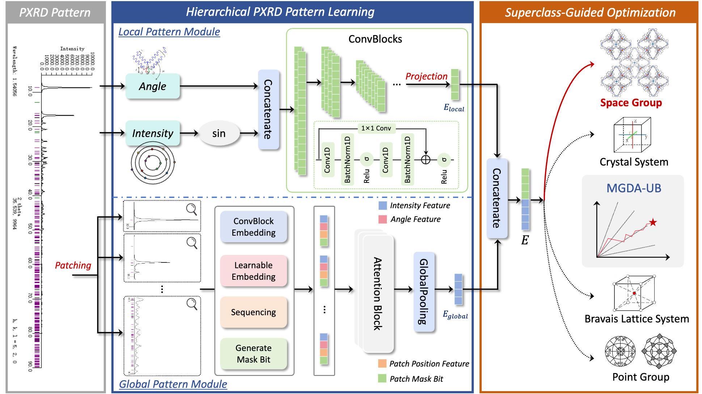

## 💡 Rethinking Crystal Symmetry Prediction: A Decoupled Perspective
Efficiently and accurately determining the symmetry is a crucial step in the structural analysis of crystalline materials. Existing methods usually mindlessly apply deep learning models while ignoring the underlying chemical rules. More importantly, experiments show that they face a serious sub-property confusion (**SPC**) problem. To address the above challenges, from a decoupled perspective, we introduce the XRDecoupler framework, a problem-solving arsenal specifically designed to tackle the **SPC** problem. Imitating the thinking process of chemists, we innovatively incorporate multidimensional crystal symmetry information as superclass guidance to ensure that the model's prediction process aligns with chemical intuition. We further design a hierarchical PXRD pattern learning model and a multi-objective optimization approach to achieve high-quality representation and balanced optimization. Comprehensive evaluations on three mainstream databases (e.g., CCDC, CoREMOF, and InorganicData) demonstrate that XRDecoupler excels in performance, interpretability, and generalization.  
**Paper link:** [https://arxiv.org/abs/2511.06976](https://arxiv.org/abs/2511.06976)
## 📝 Overall architecture of XRDecoupler



## ✅ Install dependencies
```
# Install dependencies
pip install -r requirements.txt
```

## 🚀 Run
#### try case
```
python case_try.py --data_path=./case/TATFUQ.npy  --model_path=./checkpoints/XRDecoupler.pth
```

#### train

```
python train.py 
```

#### test 

```
python test.py
```
